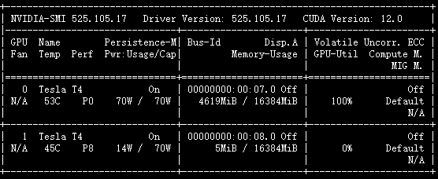
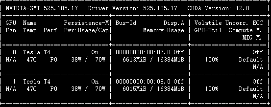
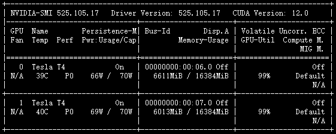
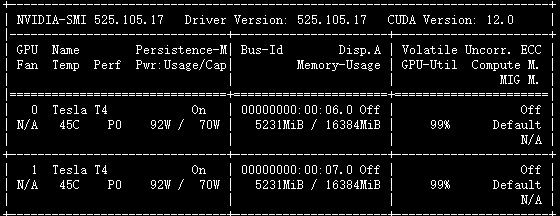

# pytorch-distributed-NLP
pytorch单机多卡分布式训练-中文文本分类。一直想尝试来着，苦于没有卡，只好花过年的压岁钱去Autodl上租了两张卡。

# 环境

```Linux+torch==2.0+transformers==4.28.1```

# 对比

| 方法                         | 耗时(分钟)                           |
| ---------------------------- | ------------------------------------ |
| 单GPU                        | 2.8276                               |
| dataparallel                 | 2.0301                               |
| distributed                  | 1.4120                               |
| distributed-multiprocess     | 1.4921                               |
| distributed-multiprocess-amp | 0.6336                               |
| horovod                      | 5.1228（存在一些问题）               |
| deepspeed                    | 1.0114（训练速度快，但效果没其他好） |


# 单GPU训练

运行：```python single-gpu-cls.py```



```python
【train】 epoch：1/1 step：1/288 loss：1.817216
【train】 epoch：1/1 step：2/288 loss：1.850495
【train】 epoch：1/1 step：3/288 loss：1.626242
【train】 epoch：1/1 step：4/288 loss：1.641953
【train】 epoch：1/1 step：5/288 loss：1.678075
```

单GPU没什么好说的。需要一提的是，通常使用```device = torch.device("cuda" if torch.cuda.is_available else "cpu")```将模型和数据放在指定的GPU或者CPU上。

# DataParallel分布式训练

基本使用：

```python
# 第一步：定义模型
model = BertForSequenceClassification.from_pretrained(args.model_path, config=config)
# 第二步：这里我们不在使用xxx.to(device)这种方式了，直接用xxx.cuda()将模型或者数据放在GPU上。
model.cuda()
# 第三步：nn.DataParallel封装模型，并指定gpu_ids的编码，比如[0,1]使用第1块和第2块GPU,output_device是在那一块GPU上进行汇总计算
model = nn.DataParallel(model, device_ids=args.gpu_ids, output_device=args.gpu_ids[0])
```

运行：```python multi-gpu-dataparrel-cls.py```


```pythn
【train】 epoch：1/1 step：1/288 loss：1.848520
【train】 epoch：1/1 step：2/288 loss：1.912011
【train】 epoch：1/1 step：3/288 loss：1.571108
【train】 epoch：1/1 step：4/288 loss：1.668026
【train】 epoch：1/1 step：5/288 loss：1.558577
```

总的step数并没有减少，但是总占用的GPU显存分布在两张显卡上。

优点：

- 易于使用。

缺点：

- 它使用一个进程来计算模型权重，然后在每个批处理期间将分发到每个GPU，因此通信很快成为一个瓶颈，GPU利用率通常很低。
- 要求所有的GPU都在同一个节点上（不支持分布式）。
- 不能使用[Apex](https://link.zhihu.com/?target=https%3A//nvidia.github.io/apex/amp.html)进行[混合精度训练](https://link.zhihu.com/?target=https%3A//devblogs.nvidia.com/mixed-precision-training-deep-neural-networks/)。

# Distributed分布式训练

基本使用：

```python
# 第零步：需要定义一个参数
import argparse
parser = argparse.ArgumentParser()
# ========================================
# 这个必须被预先定义
parser.add_argument("--local-rank", type=int, default=0)
# 第一步：初始化
dist.init_process_group(backend="nccl")
# ========================================
# 第二步：DistributedSampler，需要注意的是在train_loader里面不能再设置shuffle=True
train_dataset = ClsDataset(train_data)
train_sampler = torch.utils.data.distributed.DistributedSampler(train_dataset)
train_loader = DataLoader(train_dataset,
                              batch_size=args.train_batch_size,
                              num_workers=2,
                              collate_fn=collate.collate_fn,
                              sampler=train_sampler)
total_step = len(train_loader) * args.epochs
args.total_step = total_step
dev_dataset = ClsDataset(dev_data)
dev_sampler = torch.utils.data.distributed.DistributedSampler(dev_dataset)
dev_loader = DataLoader(dev_dataset,
                            batch_size=args.dev_batch_size,
                            shuffle=False,
                            num_workers=2,
                            collate_fn=collate.collate_fn,
                            sampler=dev_sampler)
# ========================================
# 第三步：封装模型
self.model = BertForSequenceClassification.from_pretrained(args.model_path,
                                                                   config=self.config)
self.model.cuda()
self.model = torch.nn.parallel.DistributedDataParallel(self.model, device_ids=args.device_ids)
# ========================================
for epoch in range(1, self.args.epochs + 1):
    # 第四步：训练时每一个epoch打乱数据
    train_sampler.set_epoch(epoch)
    for step, batch_data in enumerate(train_loader):
        self.model.train()
        logits, label = self.on_step(batch_data)
        """
        def on_step(self, batch_data):
            # 第五步：根据local_rank将数据分发给指定的GPU
            label = batch_data["label"].cuda()
            input_ids = batch_data["input_ids"].cuda()
            token_type_ids = batch_data["token_type_ids"].cuda()
            attention_mask = batch_data["attention_mask"].cuda()
            output = self.model(input_ids=input_ids,
                                token_type_ids=token_type_ids,
                                attention_mask=attention_mask,
                                labels=label)
            logits = output[1]
            return logits, label
        """
        # ========================================
        loss = self.criterion(logits, label)
        # 第六步：等待所有GPU
        torch.distributed.barrier()
        self.optimizer.zero_grad()
        loss.backward()
        self.optimizer.step()
        # ========================================
        # 第七步：reduce计算损失(汇总所有GPU上的结果)
        loss = self.loss_reduce(loss)
        # ========================================
        # 第八步：在主rank打印指标
        if self.args.local_rank == 0:
            print("【train】 epoch：{}/{} step：{}/{} loss：{:.6f}".format(
                epoch, self.args.epochs, gloabl_step, self.args.total_step, loss
            ))
        # ========================================
        # 第九步：在主rank保存模型
        if gloabl_step % self.args.eval_step == 0:
            loss, accuracy = self.dev(dev_loader)
            if self.args.local_rank == 0:
                print("【dev】 loss：{:.6f} accuracy：{:.4f}".format(loss, accuracy))
                if accuracy > best_acc:
                    best_acc = accuracy
                    print("【best accuracy】 {:.4f}".format(best_acc))
                    torch.save(self.model.state_dict(), self.args.ckpt_path)
# ========================================
# 最后一步
dist.destroy_process_group()
```

运行：

- nnode：1个节点

- node_rank：节点标识

- nproc_per_node：每个节点2个进程(GPU数目)

- use_env：使用系统的环境变量

- local_world_size：自定义的，GPU的数量

```python
python -m torch.distributed.launch --nnode=1 --node_rank=0 --nproc_per_node=2 --use_env multi-gpu-distributed-cls.py --local_world_size=2

或者

python -m torch.distributed.launch --nnode=1 --node_rank=0 --nproc_per_node=2 multi-gpu-distributed-cls.py --local_world_size=2
```



```python
[5574] Initializing process group with: {'MASTER_ADDR': '127.0.0.1', 'MASTER_PORT': '29500', 'RANK': '0', 'WORLD_SIZE': '2', 'LOCAL_RANK': '0'}
[5575] Initializing process group with: {'MASTER_ADDR': '127.0.0.1', 'MASTER_PORT': '29500', 'RANK': '1', 'WORLD_SIZE': '2', 'LOCAL_RANK': '1'}
[5575] rank = 1, world_size = 2, n = 1, device_ids = [1] 
[5574] rank = 0, world_size = 2, n = 1, device_ids = [0] 
```

模型会初始化两次，因为起了两个进程，每个进程都需要初始化模型一次。这里说一下rank和local_rank。在单机多卡的情况下rank和local_rank是没有区别的，它标识了当前使用的第几块GPU。

```python
【train】 epoch：1/1 step：1/144 loss：1.765123
【train】 epoch：1/1 step：2/144 loss：1.646639
【train】 epoch：1/1 step：3/144 loss：1.780050
【train】 epoch：1/1 step：4/144 loss：1.642378
【train】 epoch：1/1 step：5/144 loss：1.599494
```

总的step数减少了一半，因为并行处理数据。

在训练的时候进行验证的时候，需要把所有GPU上的结果进行reduce，再进行计算：

```python
def output_reduce(self, outputs, targets):
    output_gather_list = [torch.zeros_like(outputs) for _ in range(self.args.local_world_size)]
    # 把每一个GPU的输出聚合起来
    dist.all_gather(output_gather_list, outputs)

    outputs = torch.cat(output_gather_list, dim=0)
    target_gather_list = [torch.zeros_like(targets) for _ in range(self.args.local_world_size)]
    # 把每一个GPU的输出聚合起来
    dist.all_gather(target_gather_list, targets)
    targets = torch.cat(target_gather_list, dim=0)
    return outputs, targets
```

在加载保存好的模型进行测试的时候，要先将模型进行封装再加载保存好的权重：

```python
model = BertForSequenceClassification.from_pretrained(args.model_path, config=config)
model.cuda()
model = torch.nn.parallel.DistributedDataParallel(model, device_ids=args.device_ids)
model.load_state_dict(torch.load(args.ckpt_path))
```

# distributed分布式训练-multiprocess启动

运行：```python multi-gpu-distributed-mp-cls.py --local_world_size=2```



```python
【train】 epoch：1/1 step：1/144 loss：1.765123
【train】 epoch：1/1 step：2/144 loss：1.646639
【train】 epoch：1/1 step：3/144 loss：1.780050
【train】 epoch：1/1 step：4/144 loss：1.642378
【train】 epoch：1/1 step：5/144 loss：1.599494
```

使用时，只需要调用 torch.multiprocessing.spawn，torch.multiprocessing 就会帮助我们自动创建进程。例如有两张显卡，就设置 nprocs=2启动两个进程。

```python
mp.spawn(main_worker, nprocs=2, args=(args,))
```

主函数main_worker里面的第一个参数必须是local_rank，会自动给它赋值。然后我们需要修改：

```python
dist.init_process_group(backend="nccl", init_method="tcp://localhost:12345", world_size=local_world_size, rank=local_rank)
```

由于环境变量里面没有我们所需要的参数了，我们需要自己定义并传入到init_process_group里面。

# AMP混合精度训练

运行：```python multi-gpu-distributed-mp-amp-cls.py --local_world_size=2```

从1.6版本开始，Pytorch原生支持自动混合精度训练，并已进入稳定阶段，



```python
【train】 epoch：1/1 step：1/144 loss：1.799011
【train】 epoch：1/1 step：2/144 loss：1.654877
【train】 epoch：1/1 step：3/144 loss：1.808228
【train】 epoch：1/1 step：4/144 loss：1.615723
【train】 epoch：1/1 step：5/144 loss：1.652313
```

在distributed的基础上，额外添加以下代码即可：

```python
if self.args.use_amp:
    scaler = torch.cuda.amp.GradScaler()
for epoch in range(1, self.args.epochs + 1):
    train_sampler.set_epoch(epoch)
    for step, batch_data in enumerate(train_loader):
        self.model.train()
        if self.args.use_amp:
            with torch.cuda.amp.autocast():
                logits, label = self.on_step(batch_data)
                loss = self.criterion(logits, label)
                torch.distributed.barrier()
                scaler.scale(loss).backward()
                scaler.step(self.optimizer)
                scaler.update()
        else:
            logits, label = self.on_step(batch_data)
            loss = self.criterion(logits, label)
            torch.distributed.barrier()
            loss.backward()
            self.optimizer.step()
```

训练的时长明显变短了，模型的性能也没有下降，非常不错。

# horovod

依赖：```horovod==0.27.0```

运行：```horovodrun -np 2 -H localhost:2 python multi-gpu-horovod-cls.py```


```python
[0]<stdout>:【train】 epoch：1/1 step：1/144 loss：1.798987
[0]<stdout>:【train】 epoch：1/1 step：2/144 loss：1.654544
[0]<stdout>:【train】 epoch：1/1 step：3/144 loss：1.808229
[0]<stdout>:【train】 epoch：1/1 step：4/144 loss：1.616281
[0]<stdout>:【train】 epoch：1/1 step：5/144 loss：1.652950
```

一般流程：

```python
hvd.init()
args.local_rank = hvd.local_rank()

torch.cuda.set_device(args.local_rank)

collate = Collate(tokenizer, args.max_seq_len)
train_dataset = ClsDataset(train_data)
train_sampler = torch.utils.data.distributed.DistributedSampler(train_dataset, num_replicas=hvd.size(), rank=hvd.rank())
train_loader = DataLoader(train_dataset,
                          batch_size=args.train_batch_size,
                          num_workers=2,
                          collate_fn=collate.collate_fn,
                          sampler=train_sampler)
total_step = len(train_loader) * args.epochs
args.total_step = total_step
dev_dataset = ClsDataset(dev_data)
dev_sampler = torch.utils.data.distributed.DistributedSampler(dev_dataset, num_replicas=hvd.size(), rank=hvd.rank())
dev_loader = DataLoader(dev_dataset,
                        batch_size=args.dev_batch_size,
                        shuffle=False,
                        num_workers=2,
                        collate_fn=collate.collate_fn,
                        sampler=dev_sampler)

# 这里需要注意，不需要再封装了
model = BertForSequenceClassification.from_pretrained(args.model_path,
                                                          config=config)
model.cuda()
hvd.broadcast_parameters(model.state_dict(), root_rank=0)
optimizer = build_optimizer(model, args)

compression = hvd.Compression.fp16
optimizer = hvd.DistributedOptimizer(
    optimizer,
    named_parameters=model.named_parameters(),
    compression=compression)
hvd.broadcast_optimizer_state(optimizer, root_rank=0)
```

其余的和pytorch自带的distributed差不多，计算loss和ouptput的时候需要注意其定义的方法的区别，具体可参考其文档。

整体流程没有问题，但存在一些问题：

- 训练时长较长。
- 模型并没有被有效的训练。

# deepspeed分布式训练

```python
pip install deepspeed
sudo apt-get update
sudo apt-get install openmpi-bin libopenmpi-dev
pip install mpi4py
```


```python
【train】 epoch：1/1 step：1/288 loss：1.817383
【train】 epoch：1/1 step：2/288 loss：1.851562
【train】 epoch：1/1 step：3/288 loss：1.679688
【train】 epoch：1/1 step：4/288 loss：1.725586
【train】 epoch：1/1 step：5/288 loss：1.826172
```

如果报错：

- ModuleNotFoundError: No module named 'torch._six：找到报错的文件，

```python
注释掉：from torch._six import string_classes
加入：
int_classes = int
string_classes = str
如果还报错：NameError: name 'inf' is not defined
找到文件中的那一行，
前面加入：
import math
inf = math.inf
```

一般过程：

```python
import torch
import deepspeed

# 初始化DeepSpeed引擎
config = {
    "train_micro_batch_size_per_gpu": 32,
    "optimizer": {
        "type": "Adam",
        "params": {
            "lr": 1e-4
        }
    }
}

model.cuda()
model_engine, optimizer, _, _ = deepspeed.initialize(config_params=config，
                                              model=model,
                                              model_parameters=model.parameters())

# 获取本地rank和设备
local_rank = engine.local_rank
device = engine.device

# 加载数据
train_loader = engine.train_dataloader

# 训练循环
for epoch in range(10):
    total_loss = 0.0
    for batch_idx, (data, target) in enumerate(train_loader):
        data, target = data.cuda(), target.cuda()
        # 前向传播和损失计算
        logits = model_engine.forward(data)
        loss = CrossEntropyLoss(data, target)
        # 反向传播和优化器更新
        model_engine.backward(loss)
        model_engine.step()
        ...
```

其余的loss的reduct的output的allgather都可以使用pytorch原生的。

# 参考

> [PyTorch分布式训练简明教程(2022更新版) - 知乎 (zhihu.com)](https://zhuanlan.zhihu.com/p/113694038)
>
> [tczhangzhi/pytorch-distributed: A quickstart and benchmark for pytorch distributed training. (github.com)](https://github.com/tczhangzhi/pytorch-distributed)
>
> [Pytorch 分布式训练的坑（use_env, loacl_rank) - 知乎 (zhihu.com)](https://zhuanlan.zhihu.com/p/501632575)
>
> https://pytorch.org/docs/stable/elastic/run.html
>
> https://www.w3cschool.cn/article/76555860.htm
>
> [API — Horovod documentation](https://horovod.readthedocs.io/en/stable/api.html?highlight=allreduce#module-horovod.torch)
>
> [ChatGPT - Poe](https://poe.com/ChatGPT)
