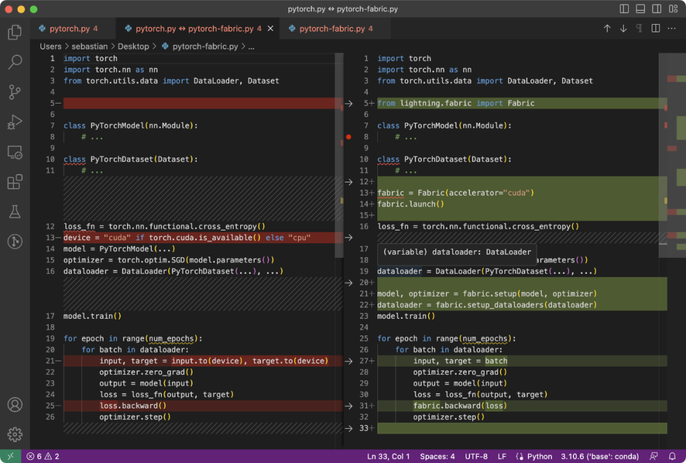
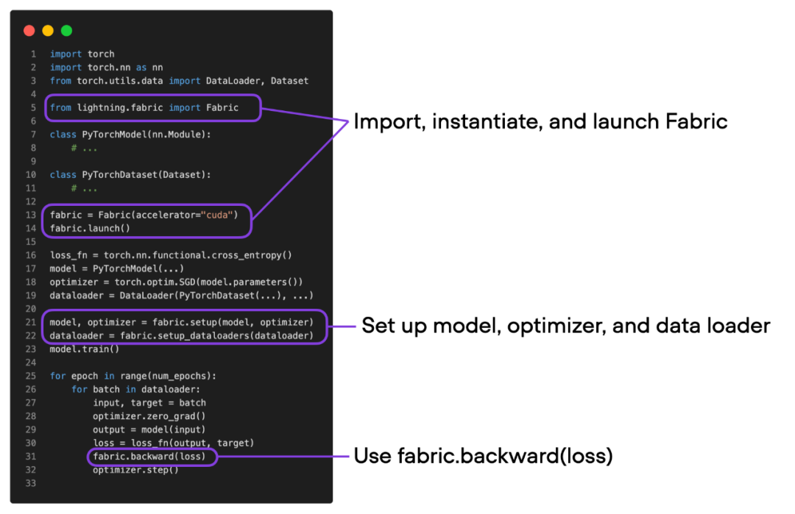

```python
pip install lightning @ git+https://github.com/Lightning-AI/lightning@master

lightning==lightning-2.1.0.dev0
transformers==4.31.0
torch==2.0.1+cu118
```

主要参考一下文章：[降龙十八掌：这套优化transformer内存占用的组合技值得收藏 - 知乎 (zhihu.com)](https://zhuanlan.zhihu.com/p/646876424)

此处的实验并不是分布式的，而是单机的，主要是减少GPU的显存占用。

原生 PyTorch 代码和修改后的使用 Fabric 的代码之间的区别很微妙，只有较小的修改，如下面的代码所示：



总结上图，将普通 PyTorch 代码转换为 PyTorch+Fabric 的主要 3 个步骤可以归纳如下：



1. 导入 Fabric 并实例化 Fabric 对象。
2. 使用 Fabric 设置模型、优化器和数据加载程序。
3. 调用 fabric.backward () 构造损失函数，而不是通常使用的 loss.backward ()


precision参数可选：('16-mixed', 'bf16-mixed', '32-true', '64-true', 64, 32, 16, '64', '32', '16', 'bf16')

T4显卡不支持bf16训练。

| 名称                                                | 占用显存（G） | 训练时间f（分钟） | F1   |
| --------------------------------------------------- | ------------- | ----------------- | ---- |
| pytorch                                             | 4.9           | 2.8344            | 0.56 |
| fabric                                              | 4.9           | 2.8235            | 0.56 |
| fabric-fp16（+混合精度训练）                        | 4.1           | 1.0042            | 0.56 |
| fabric-bf16（T4显卡不支持）                         | /             | /                 | /    |
| fabric-fp16-gc（+梯度累积）                         | 4.1           | 0.8683            | 0.56 |
| fabric-fp16-gc-sgd（adamw替换为sgd）                | 3.3           | 0.8401            | 0.34 |
| fabric-fp16-gc-sgd-frabic_init（初始化模型到GPU上） | 3.3           | 0.8655            | 0.17 |
|                                                     |               |                   |      |
|                                                     |               |                   |      |

- 微调 bert---- 完成
- 自动混合精度训练---- 完成
- 低精度训练---- 未完成
- Reduced Batch Size 训练---- 就是减少batchsize大小，这里不做实验了
- 梯度积累与 Microbatches---- 完成
- 选择更精简的优化器---- 完成
- 在目标设备上实例化模型---- 完成
- 分布式训练与张量共享---- 分布式的这里不做了
- 参数卸载---- 分布式的这里不做了

参考：

>  [降龙十八掌：这套优化transformer内存占用的组合技值得收藏 - 知乎 (zhihu.com)](https://zhuanlan.zhihu.com/p/646876424)
>
> [Efficient Initialization of Large Models - Lightning AI](https://lightning.ai/pages/community/efficient-initialization-of-large-models/)
>
> [Optimizing Memory Usage for Training LLMs and Vision Transformers in PyTorch - Lightning AI](https://lightning.ai/pages/community/tutorial/pytorch-memory-vit-llm/)